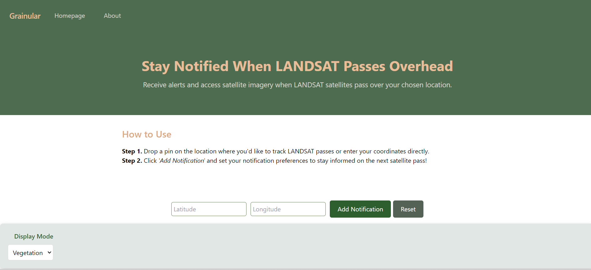

# Frontend for Granular WebApp

Landsat Surface Reflectance (SR) data can give farmers crucial agricultural information such as water use and crop health.

This data has historically been difficult to access and interpret. A strong internet connection is required to download the almost a gigabyte of data that must be parsed for useful information.

The Grainular webapp provides a shortcut to what matters. By simply specifying a coordinates or placing a pin on the map, next LandSat flyover dates and historical data for that location can be retrieved.

While data can be downloaded in a csv, no data download is required.

Our additional SMS based service allows access to future Landsat flyover dates with no internet access whatsoever.

Built in React.

# Deployment

https://grainular-7cbccc1ae880.herokuapp.com/